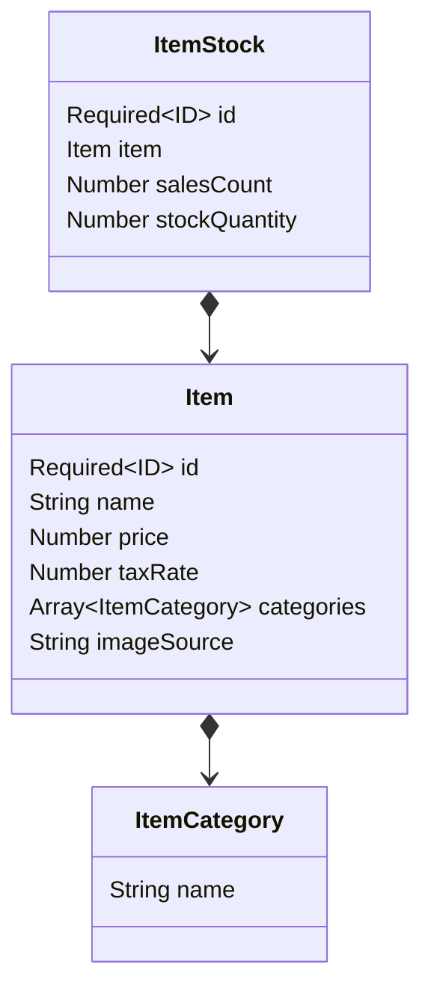

# stock-counter-doc

```mermaid
classDiagram

    class Item {
        Required~ID~ id
        String name
        Number price
        Number taxRate
        Array~ItemCategory~ categories
        String imageSource
    }
    Item *--> ItemCategory

    class ItemCategory {
        String name
    }

    class ItemStock {
        Required~ID~ id
        Item item
        Number salesCount
        Number stockQuantity
    }
    ItemStock *--> Item
```